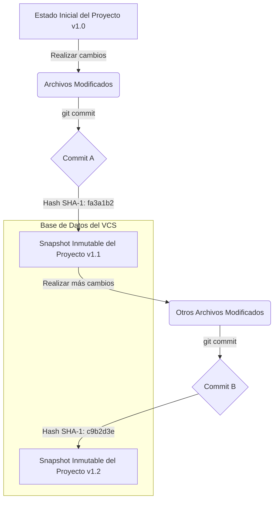

# 1.1 ¿Qué es un VCS? Un Enfoque Sistémico

## Caso de Uso

**Escenario:** Un equipo de desarrollo de un sistema de aviónica crítico para una aeronave comercial.

**Problema:** Múltiples ingenieros están modificando concurrentemente el software que controla las superficies de vuelo. Una modificación incorrecta en el módulo de cálculo de sustentación podría tener consecuencias catastróficas. Se necesita un sistema que garantice:
1.  **Auditabilidad Completa:** Saber exactamente quién, cuándo y por qué se modificó cada línea de código.
2.  **Inmutabilidad del Historial:** Asegurar que una vez que una versión del software ha sido certificada, no pueda ser alterada accidentalmente.
3.  **Reversibilidad Garantizada:** La capacidad de revertir el sistema a un estado funcional previo y conocido (`last known good state`) de forma instantánea si se detecta una anomalía.

Un simple sistema de backups o de nombrado de archivos (`flight_control_v2.c`, `flight_control_v3_final.c`) es inaceptable debido a su propensión a errores humanos y falta de granularidad.

---

## Análisis y Diseño del Sistema

Un **Sistema de Control de Versiones (VCS)** es un sistema de software diseñado para gestionar la evolución de un conjunto de datos (en nuestro caso, código fuente) a lo largo del tiempo. Su propósito fundamental no es solo "guardar versiones", sino construir un **modelo de datos histórico e inmutable**.

### Características Arquitectónicas Clave:

*   **Instantáneas (Snapshots):** A diferencia de otros sistemas que almacenan "deltas" (las diferencias entre archivos), el modelo de Git se basa en **instantáneas**. Cada vez que se guarda un cambio (`commit`), Git crea una fotografía completa del estado de todos los archivos en ese momento. Esto garantiza la integridad y simplifica la recuperación de cualquier estado histórico.

*   **Identificación Criptográfica:** Cada instantánea (commit) es identificada por un hash criptográfico SHA-1 de su contenido y metadatos. Esto implica que:
    *   El identificador es único a nivel global.
    *   Es imposible modificar el contenido de un commit sin que su hash cambie, lo que hace que el historial sea **verificable y a prueba de manipulaciones**.

*   **Fuente Única de Verdad (`Single Source of Truth`):** El VCS se convierte en la autoridad centralizada sobre el estado del código. Elimina la ambigüedad de tener múltiples versiones "finales" en distintas máquinas, proveyendo un historial coherente y auditable para todo el equipo.

### Diagrama de Flujo Conceptual

Este modelo garantiza que para cualquier punto en el tiempo, se puede reconstruir con precisión el estado exacto del sistema, cumpliendo con los estrictos requisitos del caso de uso de aviónica. El VCS no es una herramienta de conveniencia, es un componente crítico de la infraestructura de ingeniería para garantizar la calidad y seguridad del software.
