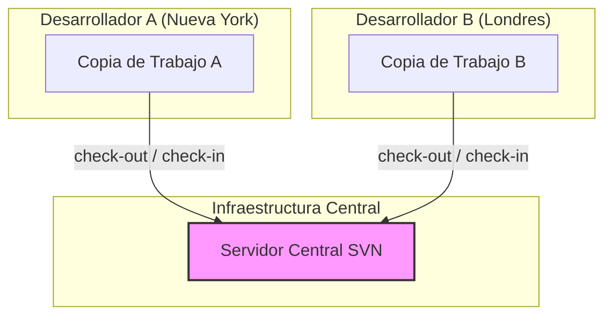
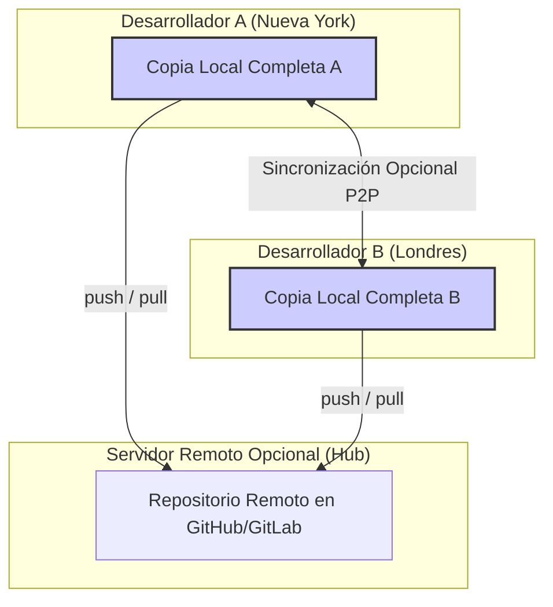

# 1.2 Arquitecturas de VCS: Centralizada vs. Distribuida

## Caso de Uso

**Escenario:** Una empresa de tecnología financiera (FinTech) desarrolla un motor de trading de alta frecuencia. El equipo de desarrollo está distribuido globalmente entre Nueva York, Londres y Hong Kong.

**Requerimientos Críticos:**
1.  **Alta Disponibilidad:** El proceso de desarrollo no puede detenerse si un servidor en una de las oficinas falla. La latencia en la sincronización de código debe ser mínima.
2.  **Operación Offline:** Los ingenieros viajan frecuentemente. Deben tener la capacidad de realizar `commits` y revisar el historial completo del proyecto sin conexión a la red.
3.  **Flujos de Trabajo Flexibles:** El equipo necesita experimentar con algoritmos de trading en ramas aisladas y fusionarlos solo después de una rigurosa revisión de código, sin que el trabajo experimental interfiera con la línea de producción principal.

---

## Análisis Comparativo de Arquitecturas

### 1. Sistema de Control de Versiones Centralizado (CVCS)

En un modelo CVCS (ej. Subversion/SVN, Perforce), existe un único servidor que actúa como la fuente de verdad. Los desarrolladores "hacen check-out" de una copia de trabajo desde este servidor.

**Diagrama de Arquitectura (CVCS):**

**Análisis de Deficiencias para el Caso de Uso:**
*   **Punto Único de Fallo (Single Point of Failure):** Si el `Servidor Central SVN` se cae, toda la operación global se detiene.
*   **Dependencia de la Red:** Operaciones como `commit`, `diff` o ver el historial (`log`) requieren una conexión al servidor central, lo que impide el trabajo `offline` y puede ser lento debido a la latencia de la red.

### 2. Sistema de Control de Versiones Distribuido (DVCS)

En un modelo DVCS (ej. Git, Mercurial), cada desarrollador "clona" el repositorio, obteniendo una réplica completa (un *mirror*) de la base de datos del VCS.

**Diagrama de Arquitectura (DVCS):**

**Análisis de Ventajas para el Caso de Uso:**
*   **Resiliencia y Redundancia:** Cada clon es un backup completo del proyecto. Si el servidor remoto falla, el sistema puede ser restaurado desde cualquier copia local.
*   **Performance y Operación Offline:** La mayoría de las operaciones (commit, diff, log, branching) son locales y, por tanto, extremadamente rápidas. El trabajo `offline` es el modo por defecto.
*   **Flujos de Trabajo Avanzados:** La existencia de repositorios locales completos facilita modelos de ramificación (`branching`) y fusión (`merging`) mucho más sofisticados y seguros.

**Conclusión:** Para el caso de uso de la FinTech, la arquitectura **distribuida (DVCS)** de Git es la única opción viable, ya que satisface los requisitos de disponibilidad, operación offline y flexibilidad que son imposibles de implementar eficientemente en un modelo centralizado.
