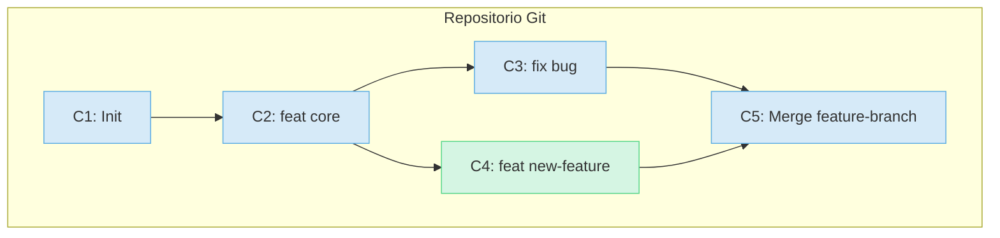

# 1.3 Git como un Grafo Acíclico Dirigido (DAG)

## Caso de Uso

**Escenario:** En un proyecto de software a gran escala, se introdujo un bug de regresión de performance muy sutil en algún momento de las últimas 1000 confirmaciones (`commits`).

**Problema:** Revisar manualmente cada uno de los 1000 commits para encontrar el cambio exacto que introdujo el problema es inviable. Se necesita un método algorítmico para buscar en el historial del proyecto. Herramientas como `git bisect` pueden automatizar esta búsqueda, pero para entender cómo funcionan, primero debemos comprender la estructura de datos subyacente que organiza el historial.

---

## Modelo de Datos de Git

A menudo se piensa en el historial de Git como una línea de tiempo lineal. Esta es una simplificación peligrosa. La verdadera estructura de datos de un repositorio de Git es un **Grafo Acíclico Dirigido (DAG)**.

*   **Grafo:** Es un conjunto de nodos (vértices) conectados por aristas.
    *   En Git, los **nodos son los commits**.
*   **Dirigido:** Las aristas tienen una dirección.
    *   En Git, cada commit **apunta a su(s) commit(s) padre(s)**. La dirección va del hijo al padre.
*   **Acíclico:** Es imposible comenzar en un nodo, seguir las aristas y volver al mismo nodo.
    *   En Git, esto garantiza que el historial siempre avanza en el tiempo y no puede haber referencias circulares. El hash de un commit depende de sus padres, por lo que un commit no puede ser su propio ancestro.

### Visualización del DAG

Consideremos un historial donde se crea una rama para una nueva funcionalidad y luego se vuelve a fusionar.

**Análisis de la Estructura:**
*   `C1` es el commit inicial. No tiene padres.
*   `C2` tiene un padre: `C1`.
*   `C3` y `C4` tienen el mismo padre: `C2`. Aquí es donde la historia divergió (se creó una rama).
*   `C5` es un **merge commit** y tiene **dos padres**: `C3` (la punta de `main` antes del merge) y `C4` (la punta de la rama de la funcionalidad).

### Implicaciones del Modelo DAG

1.  **Integridad del Historial:** Como cada commit está criptográficamente enlazado a sus padres (el hash del padre es parte del contenido que se hashea para el hijo), es computacionalmente imposible alterar un commit en el pasado sin que cambie su hash y, por consiguiente, los hashes de todos sus descendientes. Esto garantiza un historial inmutable.

2.  **Ramificación Eficiente:** Una "rama" en Git no es una copia de los archivos. Es simplemente un **puntero** con nombre que apunta a un commit específico. Crear una nueva rama es una operación extremadamente ligera y rápida ($O(1)$) que solo implica crear un nuevo puntero.

3.  **Algoritmos de Búsqueda y Navegación:** El modelo DAG permite la ejecución de algoritmos de teoría de grafos sobre el historial. La herramienta `git bisect` mencionada en el caso de uso implementa una **búsqueda binaria** sobre el DAG de commits para encontrar eficientemente la confirmación que introdujo una regresión.

**Conclusión:** Comprender que Git modela el historial como un DAG es el salto conceptual que permite pasar de ser un usuario de comandos a un ingeniero que entiende el porqué de la eficiencia, la integridad y las potentes capacidades de la herramienta.
