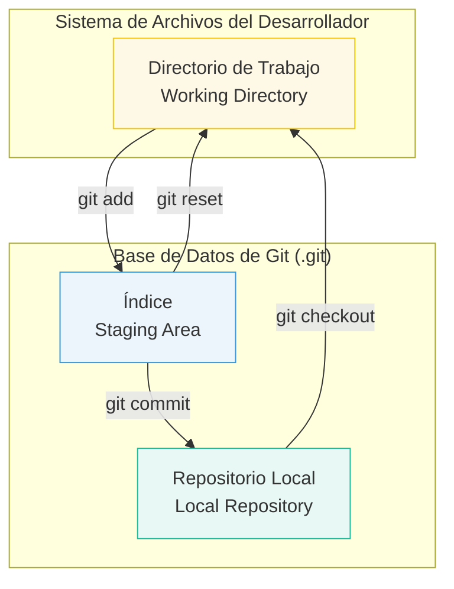

# 2.1 El Modelo de Tres Estados de Git

## Caso de Uso

**Escenario:** Un ingeniero de software está trabajando en dos tareas no relacionadas en el mismo archivo de configuración (`config.yaml`):
1.  **Tarea A (Feature):** Añadir un nuevo parámetro `cache_ttl` para una nueva funcionalidad de caching.
2.  **Tarea B (Hotfix):** Corregir un error tipográfico en la URL de la base de datos `database_url`.

**Requisito:** El hotfix (Tarea B) es urgente y debe ser desplegado inmediatamente. La nueva funcionalidad (Tarea A) todavía no está completa. Se necesita una forma de crear un `commit` que contenga **únicamente** la corrección de la Tarea B, aunque ambos cambios coexistan en el mismo archivo en el disco duro del ingeniero.

---

## El Flujo de Trabajo de Tres Estados

Git resuelve este problema con un modelo lógico que desacopla los archivos en el disco de las versiones guardadas en el historial. Este modelo tiene tres "áreas" o estados principales.

**Diagrama de Flujo de Estados:**




### 1. Directorio de Trabajo (Working Directory)

Es el estado más simple: representa la estructura de archivos y carpetas del proyecto en su sistema de archivos, tal como los ve en su editor de código. Es su "mesa de trabajo", donde los archivos pueden estar en cualquier estado: modificados, sin guardar, con cambios parciales, etc. **Git sabe que los archivos aquí han cambiado, pero no está rastreando esos cambios para el historial todavía.**

En el caso de uso, `config.yaml` en el Directorio de Trabajo contiene tanto el cambio de `cache_ttl` como la corrección de `database_url`.

### 2. El Índice (The Index / Staging Area)

Este es el componente clave para el control granular. El Índice es una **instantánea borrador** del próximo commit. Actúa como un área de preparación donde usted, el ingeniero, decide qué cambios específicos del Directorio de Trabajo quiere incluir en el próximo commit.

El comando `git add` no "añade un archivo" al historial, sino que **promueve los cambios de un archivo (o partes de él) del Directorio de Trabajo al Índice**.

**Solución al Caso de Uso:**
Para resolver el problema, el ingeniero no ejecutaría `git add config.yaml`. En su lugar, usaría un "add interactivo" o "patch add":
```bash
git add --patch config.yaml
```
Esta herramienta le preguntaría, cambio por cambio, cuál desea "preparar" (stage).
-   ¿Añadir el cambio de `database_url`? **Sí.**
-   ¿Añadir el cambio de `cache_ttl`? **No.**

Ahora, el Índice contiene una versión de `config.yaml` que solo incluye el hotfix. El Directorio de Trabajo todavía contiene ambos cambios.

### 3. El Repositorio Local (Local Repository)

Es la base de datos inmutable de Git (la carpeta `.git`) que contiene todos los commits. El comando `git commit` toma la instantánea que ha sido cuidadosamente preparada en el **Índice**, la empaqueta en un objeto commit permanente y la almacena en el Repositorio Local.

**Conclusión:** El modelo de tres estados, y en particular el **Índice**, es la característica arquitectónica que permite a los ingenieros construir **commits atómicos**: unidades de trabajo lógicas y cohesivas. Esto separa el "acto de guardar archivos" del "acto de construir el historial", permitiendo la creación de un registro de cambios limpio, profesional y fácil de auditar, tal como lo requería el caso de uso.
