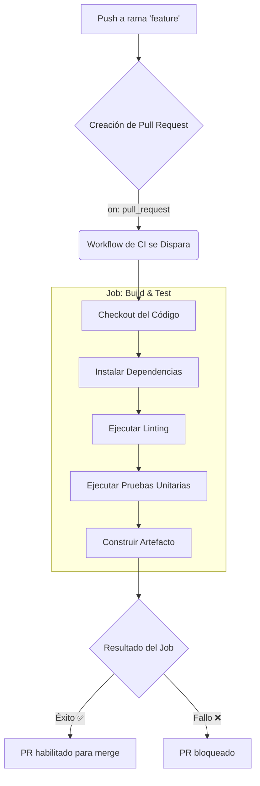

# 3.3 Introducción a CI/CD con GitHub Actions

## Caso de Uso

**Escenario:** Un equipo ágil está desarrollando una aplicación web. Su proceso de entrega de software es manual y propenso a errores.

**Puntos de Dolor (Pain Points):**
1.  **Regresiones Frecuentes:** Los desarrolladores a menudo integran código que rompe funcionalidades existentes porque olvidan ejecutar la suite de pruebas completa localmente.
2.  **Despliegues Lentos y Riesgosos:** El proceso de despliegue a producción implica que un ingeniero se conecte por SSH a un servidor, clone el repositorio, instale dependencias y reinicie el servidor. Este proceso es lento, no es repetible y cada despliegue es un evento de alto estrés.
3.  **Feedback Tardío:** Un bug puede no ser descubierto hasta días después de que el código fue escrito, haciendo su corrección más costosa.

El equipo necesita automatizar su proceso de integración y despliegue para aumentar la velocidad y la fiabilidad.

---

## Integración y Despliegue Continuo (CI/CD)

**CI/CD** es una práctica de DevOps que consiste en un conjunto de principios y flujos de trabajo automatizados para entregar software de manera frecuente y fiable.

*   **Integración Continua (CI):** Es la práctica de fusionar los cambios de código de todos los desarrolladores en una rama principal de forma regular (idealmente, varias veces al día). Cada integración es **verificada por una construcción y una serie de pruebas automatizadas**. El objetivo es detectar problemas de integración de forma temprana.

*   **Despliegue Continuo (CD):** Es la práctica que extiende la CI. Cada cambio que pasa todas las etapas de la CI es **desplegado a producción automáticamente**.

### GitHub Actions: El Motor de Automatización

**GitHub Actions** es una plataforma de CI/CD integrada directamente en GitHub. Permite definir `workflows` (flujos de trabajo) automatizados en respuesta a eventos del repositorio (ej. `push`, `pull_request`, `schedule`). Estos workflows se definen en archivos YAML y se ejecutan en "runners" (máquinas virtuales) proporcionados por GitHub.

**Diagrama de Flujo de un Pipeline de CI:**




**Resolviendo los Puntos de Dolor con un Workflow de CI:**

1.  **Prevención de Regresiones:** Al crear un Pull Request, el workflow de CI se ejecuta automáticamente. Si las pruebas fallan (`Fallo ❌`), GitHub puede impedir que el PR sea fusionado. Esto obliga a que el código esté en un estado funcional **antes** de la revisión humana y la integración, eliminando la mayoría de las regresiones.

2.  **Feedback Inmediato:** El desarrollador recibe una notificación de éxito o fallo minutos después de hacer `push`, no días. Esto acorta drásticamente el ciclo de feedback y reduce el costo de la corrección de errores.

**Extendiendo a Despliegue Continuo (CD):**

Se puede definir un segundo workflow que se active `on: push` a la rama `main`.

```yaml
# Archivo: .github/workflows/deploy.yml
name: Deploy to Production

on:
  push:
    branches:
      - main # Se activa solo en pushes a la rama principal

jobs:
  deploy:
    runs-on: ubuntu-latest
    steps:
      - name: Checkout code
        uses: actions/checkout@v3

      - name: Deploy to Server
        uses: appleboy/ssh-action@master
        with:
          host: ${{ secrets.SSH_HOST }}
          username: ${{ secrets.SSH_USER }}
          key: ${{ secrets.SSH_KEY }}
          script: |
            cd /var/www/my-app
            git pull origin main
            npm install
            pm2 restart app
```

3.  **Despliegues Rápidos y Repetibles:** Con un workflow de CD, el proceso de despliegue se convierte en un script versionado, automatizado y auditable. Cada vez que un PR es aprobado y fusionado a `main`, este workflow se ejecuta, desplegando los cambios a producción en segundos de manera consistente y fiable.

**Conclusión:** GitHub Actions transforma el repositorio de un simple almacén de código a un sistema activo que reacciona a los cambios. Al implementar un pipeline de CI/CD, los equipos pueden eliminar el error humano de los procesos de prueba y despliegue, lo que resulta en un ciclo de desarrollo más rápido, seguro y predecible, resolviendo directamente los puntos de dolor del desarrollo manual.
