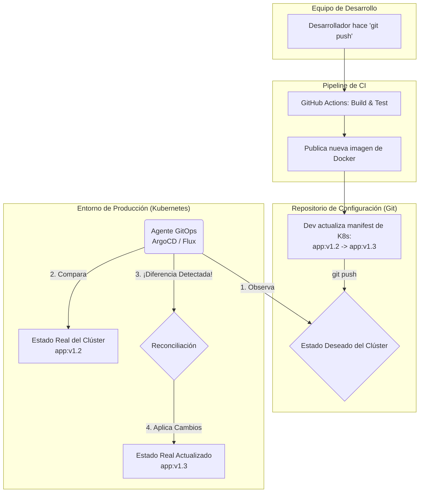

# 3.4 Conceptos Avanzados: IaC y GitOps

## Caso de Uso

**Escenario:** Una plataforma de e-commerce experimenta picos masivos de tráfico durante eventos como el Black Friday. Su infraestructura de servidores es estática, provisionada manualmente.

**Problemas Sistémicos:**
1.  **Incapacidad de Escalar:** El equipo de operaciones (Ops) no puede provisionar nuevos servidores lo suficientemente rápido para manejar el pico de tráfico, resultando en la caída del servicio y pérdida de ingresos.
2.  **Deriva de Configuración (Configuration Drift):** Con el tiempo, las configuraciones de los servidores de "desarrollo", "staging" y "producción" han divergido. Un despliegue que funcionaba en staging falla en producción debido a una diferencia sutil en la versión de una librería del sistema.
3.  **Falta de Auditabilidad:** Es imposible saber quién cambió una regla de firewall o actualizó un paquete del sistema en un servidor de producción y por qué.

Se necesita un nuevo paradigma para gestionar la infraestructura que sea tan robusto, versionable y automatizado como el proceso de desarrollo de software.

---

## Infraestructura como Código (Infrastructure as Code - IaC)

**IaC** es la práctica de gestionar y provisionar la infraestructura de TI (redes, máquinas virtuales, balanceadores de carga, etc.) a través de **archivos de definición legibles por máquina**, en lugar de configuración manual o herramientas interactivas.

El código de la infraestructura (ej. archivos de Terraform, plantillas de AWS CloudFormation, manifests de Kubernetes) se almacena y versiona en un **repositorio de Git**, junto con el código de la aplicación.

**Beneficios Inmediatos:**
*   **Repetibilidad y Consistencia:** Al definir la infraestructura en código, se puede recrear exactamente el mismo entorno una y otra vez, eliminando la deriva de configuración.
*   **Versionado y Auditoría:** Cada cambio en la infraestructura se realiza a través de un `commit`. El historial de Git proporciona un log de auditoría perfecto.
*   **Automatización:** La provisión y actualización de la infraestructura puede ser automatizada en un pipeline de CI/CD.

## GitOps: El Siguiente Paso Evolutivo

**GitOps** es un paradigma para la operación de sistemas de TI que utiliza **Git como la única fuente de verdad (`Single Source of Truth`)** para el estado deseado tanto de la aplicación como de la infraestructura.

El proceso no termina en el `push`. En un modelo GitOps, un **agente de software automatizado** se encarga de que el estado del entorno real (ej. un clúster de Kubernetes) coincida con el estado definido en el repositorio de Git.

### Flujo de Trabajo GitOps

**Resolviendo los Problemas Sistémicos:**

1.  **Escalabilidad (IaC):** Para el Black Friday, el equipo ya no provisiona servidores. Modifica un archivo de Terraform, cambiando `server_count: 5` a `server_count: 50`. Hacen `commit` y `push`. Un pipeline automatizado ejecuta `terraform apply` y la infraestructura escala en minutos.

2.  **Deriva de Configuración (GitOps):** El agente de GitOps (como ArgoCD) está constantemente comparando el estado del clúster con la definición en Git. Si un administrador se conecta a un servidor y cambia una configuración manualmente, el agente lo detectará como una "deriva" y **automáticamente revertirá el cambio** para que coincida con el estado definido en Git. Git es la única verdad.

3.  **Auditabilidad (Pull Requests):** Cualquier cambio en la infraestructura, ya sea una nueva regla de firewall o la actualización de la versión de una aplicación, debe realizarse a través de un **Pull Request** al repositorio de configuración. Esto somete los cambios de infraestructura al mismo proceso de revisión por pares, aprobación y auditoría que el código de la aplicación.

**Conclusión:** La combinación de IaC y GitOps representa la culminación de la aplicación de los principios de DevOps. Trata la gestión de la infraestructura con el mismo rigor y automatización que el desarrollo de software. Al hacer de Git la fuente de verdad para todo el sistema, se logra un nivel sin precedentes de repetibilidad, auditabilidad y fiabilidad, permitiendo a las organizaciones gestionar sistemas complejos y escalables con confianza.
