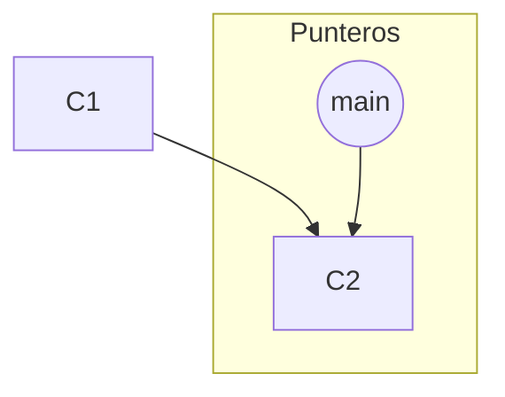
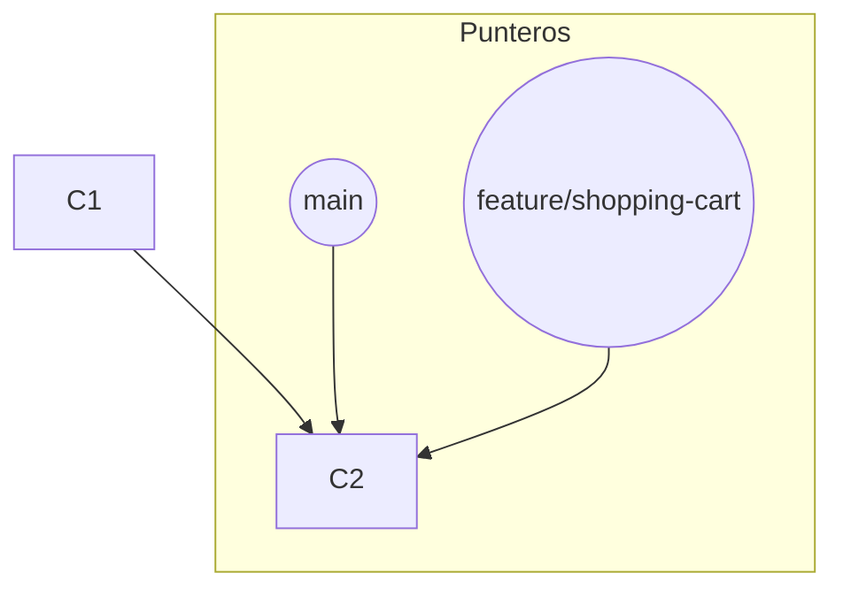
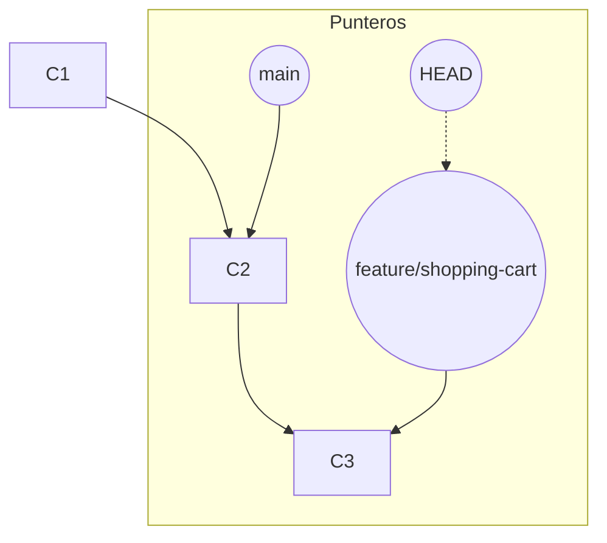

# 4.1 El Concepto de Rama en Git

## Caso de Uso

**Escenario:** Un equipo de desarrollo necesita trabajar simultáneamente en tres áreas distintas:
1.  **Tarea A:** Desarrollar una nueva funcionalidad de "carrito de compras". Se estima que tomará varias semanas.
2.  **Tarea B:** Corregir un bug crítico en el sistema de login que debe ser solucionado en horas.
3.  **Tarea C:** Experimentar con un nuevo algoritmo de recomendación que podría o no ser incluido en el producto final.

**Problema:** ¿Cómo puede el equipo aislar estos tres flujos de trabajo para que el desarrollo a largo plazo de la Tarea A no impida el despliegue urgente de la Tarea B, y para que el trabajo experimental de la Tarea C no desestabilice la base de código principal?

---

## Una Rama: Un Puntero Móvil

En muchos sistemas de control de versiones antiguos, una "rama" era una copia física de todo el código base, una operación costosa en tiempo y espacio. En Git, la realidad es mucho más elegante y eficiente.

Una **rama** en Git es simplemente un **puntero ligero y móvil que apunta a un commit específico**.

Por defecto, Git crea una rama llamada `main` (o `master`) que apunta al último commit que has realizado.

### Creación de una Rama

Cuando ejecutas `git branch <nombre-rama>`, todo lo que Git hace es crear un nuevo archivo de 41 bytes (que contiene el hash SHA-1 del commit) en el directorio `.git/refs/heads/`. Es una operación casi instantánea ($O(1)$).

**Diagrama de Estado Inicial:**

Ahora, ejecutemos `git branch feature/shopping-cart`:

**Diagrama Después de `git branch`:**

Ambas ramas apuntan al mismo commit. Aún no hay divergencia.

### Cambiando de Rama y Realizando un Commit

El puntero especial `HEAD` indica en qué rama estás trabajando actualmente. Cuando ejecutas `git checkout feature/shopping-cart`, Git mueve el puntero `HEAD` para que apunte a la nueva rama.

Si ahora realizas un nuevo commit, ocurre lo siguiente:
1.  Se crea un nuevo objeto commit (`C3`).
2.  El padre de `C3` es `C2`.
3.  La rama a la que `HEAD` apunta (`feature/shopping-cart`) **se mueve hacia adelante** para apuntar al nuevo commit `C3`. La rama `main` permanece donde estaba.

**Diagrama de Historia Divergente:**

**Resolviendo el Caso de Uso:**
El equipo crea tres ramas a partir del estado estable de `main`:
-   `git checkout -b feature/shopping-cart` (para la Tarea A)
-   `git checkout -b hotfix/login-bug` (para la Tarea B)
-   `git checkout -b experiment/recommendation-algo` (para la Tarea C)

Cada desarrollador trabaja en su rama asignada. Los commits en la rama `hotfix` no afectan a la rama `feature`, y viceversa. Una vez que el hotfix está listo, se puede fusionar a `main` y desplegar a producción de forma segura y urgente, mientras el trabajo en las otras dos ramas continúa sin interrupciones. Si el experimento de la Tarea C falla, la rama simplemente se puede eliminar sin haber afectado nunca la línea principal.

**Conclusión:** La implementación de las ramas como simples punteros es la razón por la que el "branching and merging" es una parte central y de bajo costo del flujo de trabajo de Git. Permite un **desarrollo paralelo y no bloqueante**, facilitando el aislamiento de cambios, la experimentación segura y la gestión de múltiples flujos de trabajo con una eficiencia inalcanzable en sistemas que requieren la copia física del código.
