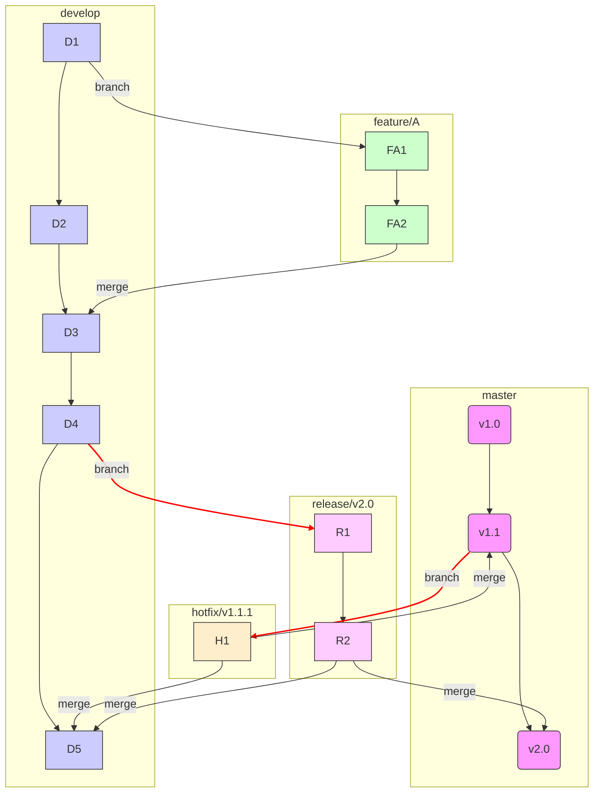

# 4.2 Modelo de Ramificación: GitFlow

## Caso de Uso

**Escenario:** Una empresa desarrolla un software de escritorio (ej. un editor de video) que se distribuye a los clientes.

**Requisitos del Ciclo de Vida:**
1.  **Versiones Múltiples:** Se debe dar soporte simultáneo a la versión actualmente en producción (ej. `v1.2`) para aplicar parches de seguridad urgentes (`hotfixes`), mientras se desarrolla la próxima versión mayor (`v2.0`).
2.  **Ciclos de Lanzamiento (Releases):** Antes de que `v2.0` sea lanzada, debe pasar por una fase de estabilización (beta testing, QA) donde solo se admiten correcciones de errores, no nuevas funcionalidades.
3.  **Desarrollo Paralelo de Funcionalidades:** Múltiples equipos deben poder desarrollar diferentes funcionalidades para `v2.0` de forma aislada y paralela.

Un modelo de ramificación simple con una sola rama `main` no es suficiente para gestionar esta complejidad.

---

## El Modelo GitFlow

**GitFlow** es una estrategia de ramificación estricta propuesta por Vincent Driessen. Está diseñada para proyectos con ciclos de lanzamiento programados y la necesidad de mantener múltiples versiones de producción. Utiliza dos ramas "eternas" y varias ramas de apoyo con un ciclo de vida definido.

### Ramas Principales

1.  `master` (o `main`): Esta rama almacena el historial de lanzamientos oficiales. Su contenido debe ser siempre estable y reflejar el código en producción. Cada commit en `master` es un nuevo lanzamiento y debe estar etiquetado con un número de versión (ej. `v1.2.0`).
2.  `develop`: Esta es la rama principal de desarrollo, donde se integra todo el trabajo para el próximo lanzamiento. Representa el estado "última versión en desarrollo" del código.

### Ramas de Apoyo

1.  **Ramas de Funcionalidad (`feature/*`):**
    *   **Se crean a partir de:** `develop`.
    *   **Se fusionan de vuelta a:** `develop`.
    *   **Propósito:** Desarrollar nuevas funcionalidades. Nunca interactúan directamente con `master`. (ej. `feature/multi-cam-editing`).

2.  **Ramas de Lanzamiento (`release/*`):**
    *   **Se crean a partir de:** `develop`.
    *   **Se fusionan de vuelta a:** `develop` **y** `master`.
    *   **Propósito:** Preparar un nuevo lanzamiento. Cuando se crea una rama `release/v2.0`, se congela el desarrollo de nuevas funcionalidades para esa versión. Solo se permiten correcciones de bugs y ajustes de documentación.

3.  **Ramas de Corrección Urgente (`hotfix/*`):**
    *   **Se crean a partir de:** `master`.
    *   **Se fusionan de vuelta a:** `develop` **y** `master`.
    *   **Propósito:** Solucionar un bug crítico en la versión de producción. Permite corregir el error sin interferir con el trabajo en `develop`.

### Diagrama de Flujo de GitFlow

**Resolviendo el Caso de Uso:**
*   **Versiones Múltiples:** La rama `master` mantiene la versión estable `v1.2`, mientras que `develop` contiene el trabajo para `v2.0`. Si se encuentra un bug en `v1.2`, se crea una rama `hotfix/security-patch` a partir de `master`, se corrige y se fusiona de nuevo a `master` (para lanzar `v1.2.1`) y a `develop` (para que `v2.0` también tenga la corrección).
*   **Ciclos de Lanzamiento:** Cuando `v2.0` está lista para QA, se crea la rama `release/v2.0` desde `develop`. El equipo de QA trabaja sobre esta rama. Los bugs encontrados se corrigen en la rama de release y se fusionan de vuelta a `develop`. Una vez estabilizada, la rama `release` se fusiona a `master` (creando la etiqueta `v2.0`) y a `develop`.
*   **Desarrollo Paralelo:** Cada nueva funcionalidad para `v2.0` se desarrolla en su propia rama `feature/*` a partir de `develop`, aislada de las demás.

**Conclusión:** GitFlow es una estrategia de ramificación **robusta y disciplinada**. Es ideal para proyectos con un modelo de lanzamiento tradicional (no de entrega continua), donde la estabilidad y el mantenimiento de múltiples versiones son primordiales. Su complejidad es su principal desventaja, y puede ser excesiva para proyectos web modernos que practican la entrega continua.
