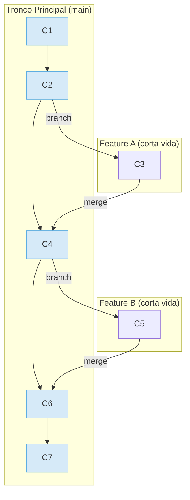

# 4.3 Modelo de Ramificación: Trunk-Based Development

## Caso de Uso

**Escenario:** Un equipo de alto rendimiento está construyendo una aplicación SaaS (Software as a Service) y practica la Entrega Continua (Continuous Delivery).

**Objetivos Clave:**
1.  **Reducir el Tiempo de Ciclo (Cycle Time):** Minimizar el tiempo que transcurre desde que se escribe una línea de código hasta que está en producción generando valor.
2.  **Evitar el "Infierno de las Fusiones" (Merge Hell):** Prevenir situaciones donde las ramas de funcionalidades viven durante semanas o meses, divergiendo tanto del tronco principal que su fusión se convierte en una tarea compleja y arriesgada.
3.  **Habilitar la Entrega Continua:** El código en el tronco principal (`main`) debe estar siempre en un estado desplegable.

El modelo GitFlow, con sus múltiples ramas de larga duración, es un anti-patrón para este equipo, ya que retrasa la integración.

---

## Trunk-Based Development (TBD)

**Trunk-Based Development** es una estrategia de ramificación donde todos los desarrolladores colaboran en el desarrollo de una única rama principal llamada "tronco" (`trunk`), que comúnmente es `main` (o `master`).

El principio fundamental es que **el código se integra al tronco con mucha frecuencia** (al menos una vez al día). Las ramas de funcionalidad existen, pero son extremadamente **efímeras** (de corta duración), viviendo típicamente por unas pocas horas o un par de días como máximo.

### Flujo de Trabajo de TBD

1.  Se crea una rama de funcionalidad (`feature/short-lived-branch`) a partir de `main`.
2.  El desarrollador realiza un número muy pequeño de commits en esa rama.
3.  Se abre un Pull Request.
4.  Pasa la revisión de código y los chequeos de CI.
5.  Se fusiona de vuelta a `main` rápidamente.

### Diagrama de Flujo de TBD



### ¿Cómo se gestionan las funcionalidades incompletas?

Si las ramas deben ser de corta duración, ¿cómo se evita desplegar a producción una funcionalidad que está a medio construir? La respuesta es el uso de **Feature Flags (o Feature Toggles)**.

Un **Feature Flag** es una técnica que permite modificar el comportamiento del sistema sin cambiar el código. Esencialmente, es un `if` en el código que activa o desactiva una funcionalidad basándose en una configuración externa.

```python
# Ejemplo de Feature Flag en Python
def user_profile_view(request, user_id):
    # ... lógica existente ...

    # El nuevo código está envuelto en un feature flag
    if feature_flags.is_enabled('show-new-avatar-uploader'):
        # Lógica para el nuevo subidor de avatares
        ...
    
    return render(...)
```

Con este enfoque, el código para el nuevo subidor de avatares puede ser fusionado a `main` aunque no esté 100% completo, porque la bandera `show-new-avatar-uploader` estará desactivada en producción. Esto permite la integración continua del código, desacoplando la **integración de código** del **lanzamiento de funcionalidades**.

**Resolviendo los Objetivos del Caso de Uso:**

1.  **Reducción del Tiempo de Ciclo:** Al integrar continuamente en `main`, el código llega al pipeline de CI/CD casi inmediatamente, y si se practica la Entrega Continua, puede ser desplegado a producción el mismo día.
2.  **Prevención del "Merge Hell":** Como las ramas viven por muy poco tiempo, la divergencia con `main` es mínima. Las fusiones son pequeñas, frecuentes y de bajo riesgo.
3.  **Habilitación de la Entrega Continua:** El uso de Feature Flags asegura que `main` siempre esté en un estado desplegable, incluso con funcionalidades a medio terminar "escondidas" detrás de una bandera.

**Conclusión:** Trunk-Based Development es la estrategia de ramificación **preferida para equipos que aspiran a la Entrega Continua y DevOps**. Prioriza la velocidad de integración y el flujo continuo de cambios. Aunque parece más simple, requiere una alta disciplina de ingeniería, incluyendo una robusta suite de pruebas automatizadas y un uso inteligente de Feature Flags para mantener la estabilidad del tronco.
