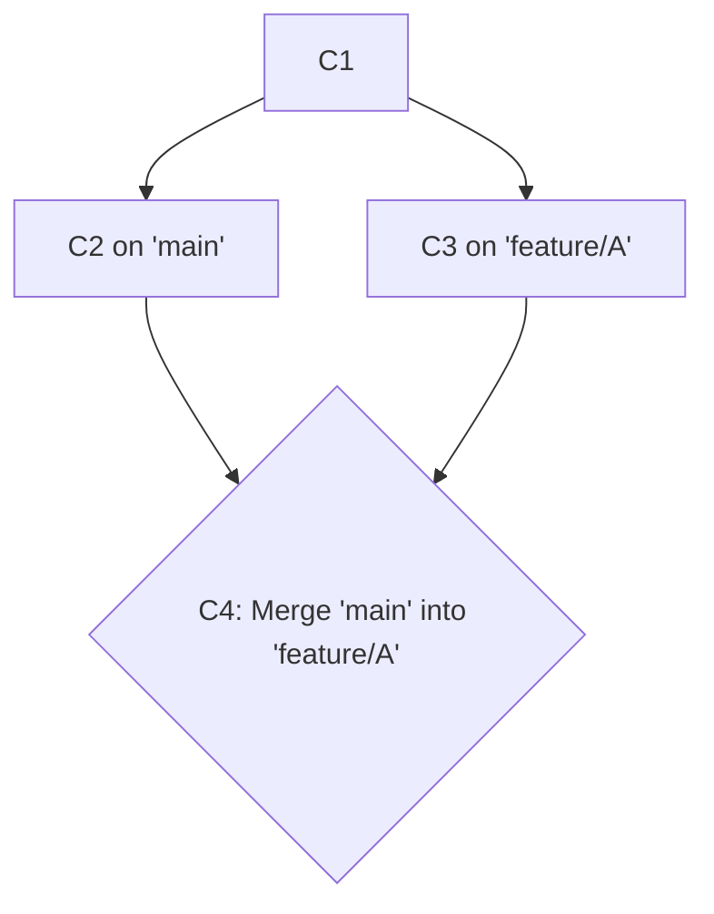
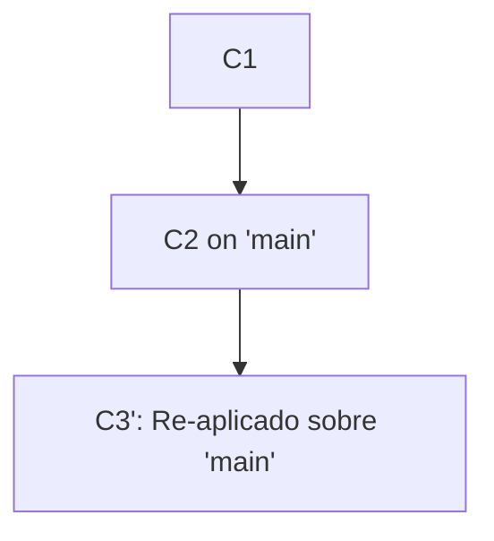

# 4.4 Integrando Cambios: Merge vs. Rebase

## Caso de Uso

**Escenario:** Un desarrollador, Alex, está trabajando en una rama de funcionalidad (`feature/A`). Mientras tanto, su colega, Bea, ha completado su trabajo en otra rama (`feature/B`) y la ha fusionado a la rama principal (`main`).

**Problema:** La rama de Alex (`feature/A`) ahora está **desactualizada**. No contiene los últimos cambios de `main` (el trabajo de Bea). Alex necesita integrar estos nuevos cambios de `main` en su rama de funcionalidad **antes** de poder abrir un Pull Request, para asegurarse de que su funcionalidad es compatible con el código más reciente.

Existen dos estrategias fundamentales para lograr esta integración: `git merge` y `git rebase`. La elección entre ellas tiene un impacto significativo en la estructura y legibilidad del historial del proyecto.

---

### Estrategia 1: `git merge`

El comando `git merge` integra los cambios de una rama en otra. Específicamente, crea un nuevo **"merge commit"** en la rama receptora. Este commit especial tiene dos padres: la punta de la rama receptora y la punta de la rama que se está fusionando.

**Flujo del Comando:**
```bash
# Estando en la rama de Alex
git checkout feature/A

# Integrar los cambios de main en feature/A
git merge main
```

**Resultado en el Historial (DAG):**



*   **Pros:**
    *   **Preserva la Historia Real:** El historial es un registro veraz de lo que ocurrió. Muestra explícitamente que el trabajo en `feature/A` se hizo en paralelo al de `main` y luego se sincronizó en un punto específico. Es no destructivo.
*   **Contras:**
    *   **Historial "Ruidoso":** Si muchos desarrolladores fusionan `main` en sus ramas frecuentemente, el historial se llena de commits de merge, creando un grafo complejo y difícil de leer, a menudo llamado "historial de espagueti".

---

### Estrategia 2: `git rebase`

El comando `git rebase` ofrece una alternativa. En lugar de crear un merge commit, "rebasa" la rama de funcionalidad. Esto significa que toma todos los commits de la rama de funcionalidad y los **reaplica uno por uno** sobre la punta de la rama principal.

**Flujo del Comando:**
```bash
# Estando en la rama de Alex
git checkout feature/A

# Re-aplicar los commits de feature/A sobre la punta de main
git rebase main
```

**Resultado en el Historial (DAG):**



El commit `C3` original es abandonado, y se crea un nuevo commit `C3'` con el mismo contenido pero con `C2` como su padre.

*   **Pros:**
    *   **Historial Lineal y Limpio:** El resultado es un historial perfectamente lineal, como si todo el trabajo se hubiera hecho en serie. Es mucho más fácil de leer y seguir.
*   **Contras:**
    *   **Reescribe la Historia:** `rebase` crea nuevos commits y abandona los antiguos. Esto es una operación **destructiva**. La regla de oro es: **nunca hagas rebase sobre una rama pública que otros puedan estar utilizando**, ya que estarías reescribiendo una historia compartida, lo que puede causar serios problemas. Es seguro hacerlo en tu propia rama local antes de compartirla.
    *   **Pierde Contexto:** Se pierde la información de cuándo se realizaron realmente los commits en paralelo.

### ¿Cuál Elegir?

No hay una respuesta única. Es una decisión de equipo.
*   Un **flujo de trabajo con `merge`** prioriza la **trazabilidad** y la exactitud histórica a costa de la simplicidad del grafo.
*   Un **flujo de trabajo con `rebase`** prioriza la **legibilidad** y un historial lineal a costa de reescribir la historia local.

Una estrategia híbrida muy popular es:
1.  **Usar `rebase`** para actualizar las ramas de funcionalidad locales con los últimos cambios de `main` (`git pull --rebase`).
2.  **Usar `merge` (generalmente con la opción `--no-ff`)** para fusionar el Pull Request de la rama de funcionalidad a `main`. Esto mantiene el historial de `main` limpio, pero también preserva el contexto de la rama de funcionalidad como una unidad de trabajo.
