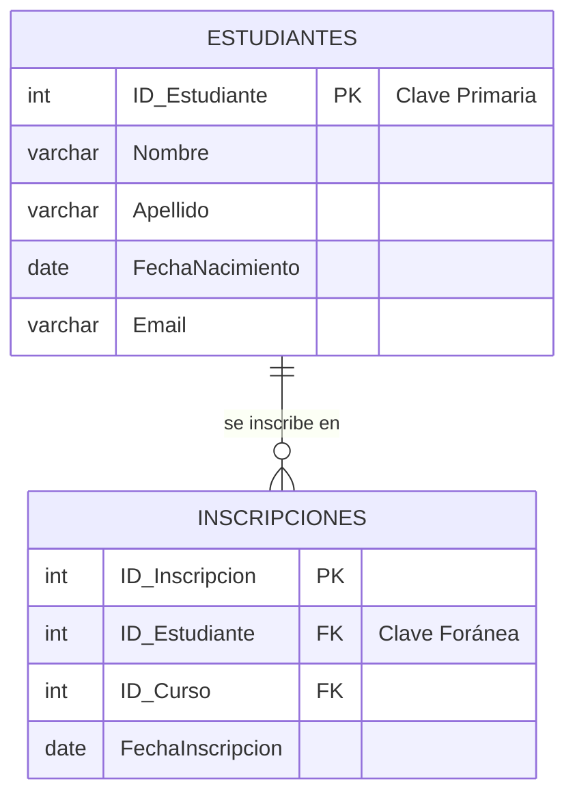

# 1.1 El Modelo Relacional y sus Componentes

## Caso de Uso

**Escenario:** En el "Sistema de Gestión Académica de Architek-Pro", necesitamos modelar la entidad fundamental: el **Estudiante**.

**Requisitos de Modelado:**
1.  **Representación:** Debemos poder representar a cada estudiante y sus propiedades (ej. nombre, fecha de nacimiento, correo electrónico).
2.  **Unicidad:** Cada estudiante debe ser identificable de forma única e inequívoca en todo el sistema. No puede haber dos estudiantes con el mismo identificador.
3.  **Relaciones:** Debemos ser capaces de vincular a un estudiante con otras entidades, como los Cursos en los que está inscrito.

---

## Componentes del Modelo Relacional

El modelo relacional, propuesto por Edgar F. Codd, se basa en los principios matemáticos de la teoría de conjuntos y la lógica de predicados. Proporciona una forma estructurada y predecible de almacenar y recuperar datos.

*   **Entidad:** Una representación de un objeto del mundo real que queremos modelar. En nuestro caso, `Estudiante` es una entidad. También lo serían `Curso` y `Profesor`.
*   **Relación (o Tabla):** La implementación de una entidad en la base de datos. Es una estructura de dos dimensiones compuesta por filas y columnas.
*   **Tupla (o Fila / Registro):** Una única instancia de una entidad. Representa a un estudiante específico, por ejemplo, "Ana Torres".
*   **Atributo (o Columna / Campo):** Una propiedad que describe a la entidad. Por ejemplo, `nombre`, `fecha_nacimiento`, `email`.

### El Concepto de Claves (Keys)

Las claves son atributos o conjuntos de atributos con un propósito especial: establecer la unicidad y las relaciones.

1.  **Clave Candidata:** Un atributo o conjunto de atributos que puede identificar de forma única una tupla en una relación. Por ejemplo, en una tabla `Estudiantes`, tanto el `numero_de_matricula` como el `correo_electronico` podrían ser claves candidatas, ya que se espera que ambos sean únicos.

2.  **Clave Primaria (Primary Key - PK):** Es la **clave candidata elegida** por el diseñador de la base de datos para ser el identificador principal de la tabla. A menudo, se utiliza una clave "sustituta" (surrogate key), como un `id` numérico autoincremental, que no tiene significado en el mundo real pero es eficiente para la base de datos.
    *   **Requisito del Caso de Uso:** `ID_Estudiante` será nuestra PK para la tabla `Estudiantes`, garantizando la unicidad.

3.  **Clave Foránea (Foreign Key - FK):** Un atributo o conjunto de atributos en una tabla que apunta a la Clave Primaria de otra tabla. Este es el mecanismo que **crea las relaciones**.
    *   **Requisito del Caso de Uso:** Para vincular a un estudiante con sus inscripciones, la tabla `Inscripciones` tendrá un atributo `ID_Estudiante` que será una FK apuntando a la PK de la tabla `Estudiantes`.

### Diagrama Entidad-Relación (ERD) Inicial

**Análisis del Diagrama:**
*   `ESTUDIANTES` es una entidad con `ID_Estudiante` como su PK.
*   `INSCRIPCIONES` es otra entidad. Contiene `ID_Estudiante` como FK.
*   La línea `||--o{` representa una relación de "uno a muchos": un estudiante puede tener cero o muchas inscripciones.

**Conclusión:** El modelo relacional, a través de sus componentes y, fundamentalmente, del sistema de claves (PK/FK), nos permite construir un esquema de datos que no solo almacena información, sino que también define y **hace cumplir las reglas de negocio** (como la unicidad de los estudiantes y la vinculación entre ellos y sus inscripciones) a nivel de la propia base de datos.
