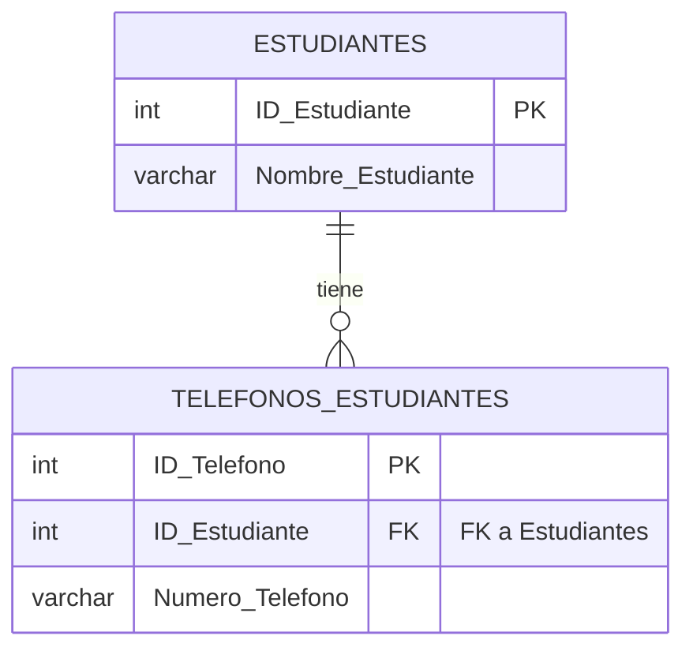

# 2.2 Primera Forma Normal (1NF): Atomicidad

## Pre-requisito

Antes de aplicar cualquier forma normal, se debe haber definido una **clave primaria** para la tabla.

## Definición Formal de 1NF

Una tabla está en **Primera Forma Normal (1NF)** si cumple con dos condiciones:
1.  **Atomicidad:** Todos los atributos (columnas) contienen valores **atómicos** (indivisibles). Una celda no puede contener una lista de valores, un conjunto de datos o cualquier tipo de estructura anidada.
2.  **No Grupos Repetitivos:** No existen "grupos de columnas repetidas" que almacenen el mismo tipo de dato.

---

## Caso de Uso: Aplicando 1NF a Architek-Pro

**Escenario:** En una primera iteración del diseño, para registrar los teléfonos de un estudiante, se propone una de las siguientes tablas, ambas **incorrectas**.

### Violación 1: Atributos no Atómicos

**Tabla `Estudiantes_No_Atomica`:**

| ID_Estudiante (PK) | Nombre_Estudiante | Telefonos |
| :--- | :--- | :--- |
| 101 | Ana Torres | "555-1234, 555-5678" |
| 102 | Luis Rios | "555-8765" |

**Análisis:**
La columna `Telefonos` viola la atomicidad. Contiene una cadena de texto que representa una lista de dos números de teléfono.
*   **Problemas:** ¿Cómo busco a un estudiante que tenga el número "555-5678"? Requiere un procesamiento de cadenas (`LIKE '%555-5678%'`), lo cual es ineficiente y propenso a errores. ¿Cómo aplico una restricción para que los números de teléfono sigan un formato específico? Es imposible a nivel de base de datos.

### Violación 2: Grupos Repetitivos

**Tabla `Estudiantes_Grupos_Repetitivos`:**

| ID_Estudiante (PK) | Nombre_Estudiante | Telefono_1 | Telefono_2 | Telefono_3 |
| :--- | :--- | :--- | :--- | :--- |
| 101 | Ana Torres | "555-1234" | "555-5678" | `NULL` |
| 102 | Luis Rios | "555-8765" | `NULL` | `NULL` |

**Análisis:**
Las columnas `Telefono_1`, `Telefono_2`, `Telefono_3` son un grupo repetitivo.
*   **Problemas:** ¿Qué pasa si un estudiante tiene cuatro números de teléfono? El diseño actual no lo soporta. Tendríamos que añadir una columna `Telefono_4` (`ALTER TABLE`), modificando la estructura de la base de datos para un solo caso. La mayoría de las columnas estarán `NULL`, desperdiciando espacio y haciendo las consultas más complejas (ej. `WHERE Telefono_1 = 'x' OR Telefono_2 = 'x' OR ...`).

---

## Solución: Descomposición a 1NF

La solución para ambas violaciones es la misma: **descomponer la información en una nueva tabla relacionada**.

1.  La tabla original `Estudiantes` se limpia para contener solo información del estudiante.
2.  Se crea una nueva tabla `Telefonos_Estudiantes` para almacenar los números de teléfono.

### Diagrama ERD de la Solución 1NF

**Tabla `Estudiantes` (en 1NF):**

| ID_Estudiante (PK) | Nombre_Estudiante |
| :--- | :--- |
| 101 | Ana Torres |
| 102 | Luis Rios |

**Tabla `Telefonos_Estudiantes` (en 1NF):**

| ID_Telefono (PK) | ID_Estudiante (FK) | Numero_Telefono |
| :--- | :--- | :--- |
| 1 | 101 | "555-1234" |
| 2 | 101 | "555-5678" |
| 3 | 102 | "555-8765" |

**Beneficios de la Solución:**
*   **Atomicidad Lograda:** Cada celda contiene un único valor.
*   **Flexibilidad:** Un estudiante puede tener cualquier número de teléfonos (cero, uno o muchos) simplemente añadiendo filas a `Telefonos_Estudiantes`, sin alterar la estructura.
*   **Consultas Eficientes:** Buscar un número de teléfono es ahora una consulta simple e indexada sobre la columna `Numero_Telefono`.
*   **Integridad de Dominio:** Podemos aplicar restricciones de formato a la columna `Numero_Telefono`.

**Conclusión:** La Primera Forma Normal es el primer paso, y el más fundamental, en el diseño de bases de datos. Elimina las estructuras de datos anidadas y los grupos repetitivos, sentando las bases para un esquema flexible, escalable y consultable de manera eficiente.
