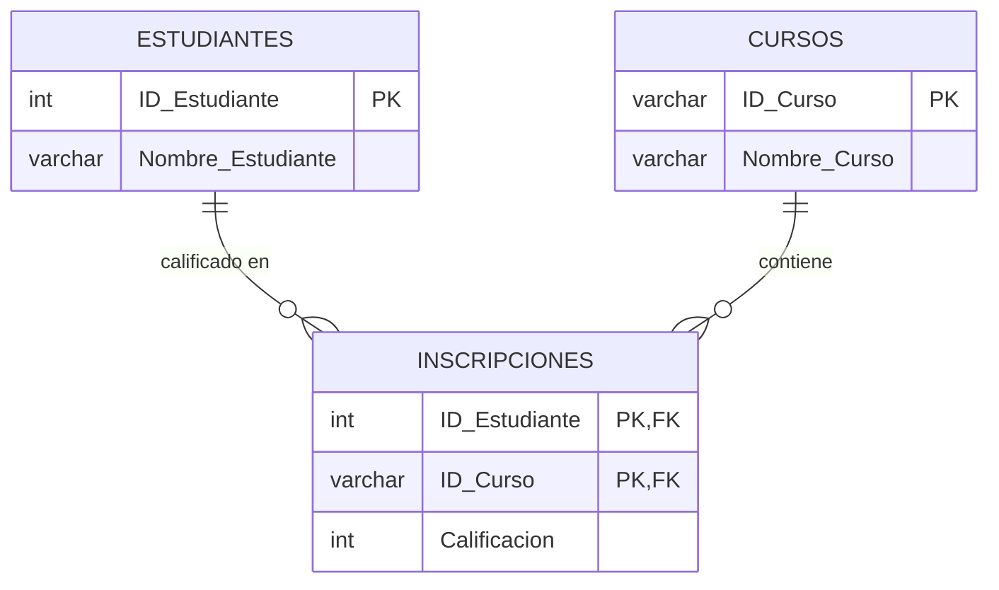

# 2.3 Segunda Forma Normal (2NF): Eliminación de Dependencias Parciales

## Pre-requisito

Una tabla debe estar en **Primera Forma Normal (1NF)** antes de poder aplicar la 2NF.

## Definición Formal de 2NF

Una tabla está en **Segunda Forma Normal (2NF)** si cumple con dos condiciones:
1.  Está en 1NF.
2.  **No existen dependencias parciales.** Esto significa que todos los atributos que no forman parte de la clave primaria deben depender **funcionalmente de toda la clave primaria**, no solo de una parte de ella.

**Implicación Clave:** La 2NF es relevante **únicamente** para tablas cuya clave primaria es una **clave compuesta** (formada por dos o más columnas). Si una tabla tiene una clave primaria de una sola columna, y ya está en 1NF, entonces está automáticamente en 2NF.

---

## Caso de Uso: Aplicando 2NF al SISA

**Escenario:** Para registrar qué estudiante se inscribe en qué curso y con qué calificación, se propone la siguiente tabla.

**Tabla `Inscripciones_1NF`:**

| ID_Estudiante (PK, FK) | ID_Curso (PK, FK) | Nombre_Estudiante | Nombre_Curso | Calificacion |
| :--- | :--- | :--- | :--- | :--- |
| 101 | CS101 | Ana Torres | Intro a la IA | 95 |
| 102 | CS101 | Luis Rios | Intro a la IA | 88 |
| 101 | MA203 | Ana Torres | Cálculo Vectorial | 92 |

**Análisis de la Estructura:**
*   La tabla está en 1NF (todos los valores son atómicos).
*   La **clave primaria es compuesta**: (`ID_Estudiante`, `ID_Curso`). Juntos, identifican unívocamente cada inscripción.

**Identificando las Dependencias Funcionales:**
1.  `{ID_Estudiante, ID_Curso} → Calificacion`
    *   La calificación depende de *qué estudiante* y de *qué curso*. Depende de **toda la clave**. Esta dependencia es correcta.
2.  `ID_Estudiante → Nombre_Estudiante`
    *   El nombre del estudiante depende **solo de una parte** de la clave (`ID_Estudiante`). Esta es una **dependencia parcial**.
3.  `ID_Curso → Nombre_Curso`
    *   El nombre del curso depende **solo de la otra parte** de la clave (`ID_Curso`). Esta también es una **dependencia parcial**.

**Anomalías Causadas por Dependencias Parciales:**
*   **Anomalía de Actualización:** Si el nombre del curso "Intro a la IA" cambia a "Introducción a la Inteligencia Artificial", debemos actualizarlo en múltiples filas, con el riesgo de inconsistencia.
*   **Anomalía de Inserción:** No podemos registrar un nuevo curso (ej. "CS301 - Sistemas Operativos") hasta que al menos un estudiante se inscriba.
*   **Anomalía de Borrado:** Si el último estudiante de "Cálculo Vectorial" se da de baja, al borrar su inscripción perdemos la información del curso.

---

## Solución: Descomposición a 2NF

La solución es descomponer la tabla original, creando tablas separadas para las entidades que las dependencias parciales revelan: `Estudiantes` y `Cursos`.

### Diagrama ERD de la Solución 2NF

**Tabla `Estudiantes` (en 2NF):**

| ID_Estudiante (PK) | Nombre_Estudiante |
| :--- | :--- |
| 101 | Ana Torres |
| 102 | Luis Rios |

**Tabla `Cursos` (en 2NF):**

| ID_Curso (PK) | Nombre_Curso |
| :--- | :--- |
| CS101 | Intro a la IA |
| MA203 | Cálculo Vectorial |

**Tabla `Inscripciones` (en 2NF):**

| ID_Estudiante (PK, FK) | ID_Curso (PK, FK) | Calificacion |
| :--- | :--- | :--- |
| 101 | CS101 | 95 |
| 102 | CS101 | 88 |
| 101 | MA203 | 92 |

**Beneficios de la Solución:**
*   **Redundancia Eliminada:** El nombre de cada estudiante y de cada curso ahora se almacena una sola vez.
*   **Anomalías Resueltas:**
    *   **Actualización:** El nombre de un curso se cambia en un único lugar: la tabla `Cursos`.
    *   **Inserción:** Podemos añadir nuevos cursos a la tabla `Cursos` sin necesidad de tener estudiantes inscritos.
    *   **Borrado:** Podemos eliminar una inscripción sin perder la información del curso o del estudiante.

**Conclusión:** La Segunda Forma Normal es un paso crítico para eliminar la redundancia en bases de datos relacionales. Al asegurar que cada atributo no-clave dependa de la totalidad de la clave primaria, forzamos una descomposición lógica de la información en tablas separadas, cada una representando una única entidad del mundo real.
