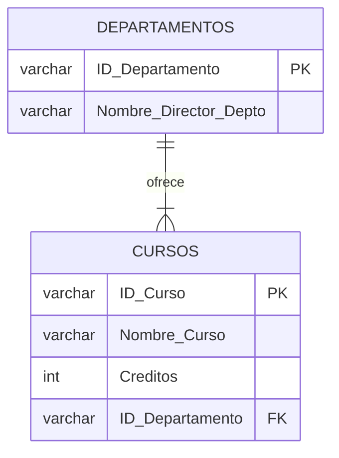

# 2.4 Tercera Forma Normal (3NF): Eliminación de Dependencias Transitivas

## Pre-requisito

Una tabla debe estar en **Segunda Forma Normal (2NF)** antes de poder aplicar la 3NF.

## Definición Formal de 3NF

Una tabla está en **Tercera Forma Normal (3NF)** si cumple con dos condiciones:
1.  Está en 2NF.
2.  **No existen dependencias transitivas.** Una dependencia transitiva ocurre cuando un atributo que no forma parte de la clave (un atributo no-clave) depende funcionalmente de otro atributo no-clave.

El mantra para recordar la 3NF es:
> "Cada atributo no-clave debe proveer información sobre la clave, toda la clave, y **nada más que la clave**."
> — Bill Kent

---

## Caso de Uso: Aplicando 3NF a Architek-Pro

**Escenario:** Después de alcanzar la 2NF, tenemos una tabla de `Cursos`. El diseñador decide añadir información sobre el departamento que ofrece el curso y el director de ese departamento.

**Tabla `Cursos_2NF`:**

| ID_Curso (PK) | Nombre_Curso | Creditos | ID_Departamento | Nombre_Director_Depto |
| :--- | :--- | :--- | :--- | :--- |
| CS101 | Intro a la IA | 4 | CS | Dra. Ada Lovelace |
| MA203 | Cálculo Vectorial | 3 | MATH | Dr. Isaac Newton |
| CS201 | Estructuras de Datos | 4 | CS | Dra. Ada Lovelace |

**Análisis de la Estructura:**
*   La tabla está en 1NF (valores atómicos).
*   La tabla está en 2NF (la clave primaria `ID_Curso` es una sola columna, por lo que no hay dependencias parciales).

**Identificando las Dependencias Funcionales:**
1.  `ID_Curso → Nombre_Curso` (Correcto)
2.  `ID_Curso → Creditos` (Correcto)
3.  `ID_Curso → ID_Departamento` (Correcto)
4.  `ID_Departamento → Nombre_Director_Depto`
    *   **¡Problema!** El nombre del director del departamento no depende de la clave (`ID_Curso`). Depende de otro atributo no-clave (`ID_Departamento`).
    *   Esta es una **dependencia transitiva**: `ID_Curso → ID_Departamento → Nombre_Director_Depto`.

**Anomalías Causadas por Dependencias Transitivas:**
*   **Anomalía de Actualización:** Si la Dra. Lovelace deja de ser directora del departamento de Ciencias de la Computación (CS), debemos actualizar su nombre en **todas las filas** de cursos de ese departamento. Hay un alto riesgo de inconsistencia.
*   **Anomalía de Inserción:** No podemos registrar un nuevo departamento y su director hasta que se ofrezca al menos un curso de ese departamento.
*   **Anomalía de Borrado:** Si eliminamos el último curso del departamento de Matemáticas (MATH), perdemos la información de que el Dr. Newton es su director.

---

## Solución: Descomposición a 3NF

Descomponemos la tabla, moviendo la dependencia transitiva a su propia tabla, en este caso, una tabla `Departamentos`.

### Diagrama ERD de la Solución 3NF

**Tabla `Departamentos` (en 3NF):**

| ID_Departamento (PK) | Nombre_Director_Depto |
| :--- | :--- |
| CS | Dra. Ada Lovelace |
| MATH | Dr. Isaac Newton |

**Tabla `Cursos` (en 3NF):**

| ID_Curso (PK) | Nombre_Curso | Creditos | ID_Departamento (FK) |
| :--- | :--- | :--- | :--- |
| CS101 | Intro a la IA | 4 | CS |
| MA203 | Cálculo Vectorial | 3 | MATH |
| CS201 | Estructuras de Datos | 4 | CS |

**Beneficios de la Solución:**
*   **Redundancia Eliminada:** El nombre del director de cada departamento ahora se almacena una sola vez.
*   **Anomalías Resueltas:**
    *   **Actualización:** El director de un departamento se cambia en una única fila en la tabla `Departamentos`.
    *   **Inserción:** Podemos añadir nuevos departamentos independientemente de los cursos.
    *   **Borrado:** Eliminar un curso ya no elimina la información del departamento.

**Conclusión:** La Tercera Forma Normal completa el proceso de normalización para la mayoría de las aplicaciones de negocio. Al eliminar las dependencias transitivas, nos aseguramos de que cada tabla represente una única entidad y que todos sus atributos describan exclusivamente a esa entidad. Esto resulta en un esquema de base de datos que es robusto, eficiente y que protege la integridad de los datos a largo plazo.
