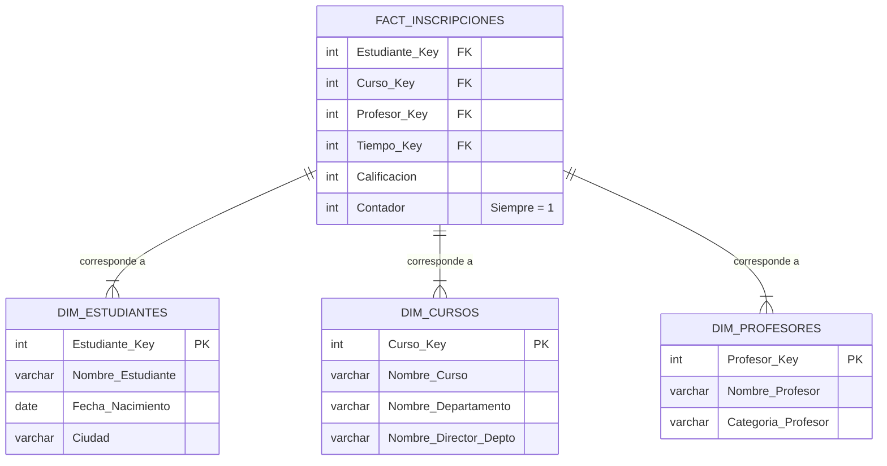

# 2.5 Desnormalización y Modelado para Análisis de Datos

## Caso de Uso

**Escenario:** El decano del SISA necesita un informe trimestral que muestre el número de estudiantes inscritos y la calificación promedio por curso, por profesor y por departamento. El analista de datos intenta ejecutar una consulta SQL en la base de datos de producción (normalizada hasta 3NF) para generar este informe.

**Problema:** La consulta requiere múltiples `JOINs` entre las tablas `Inscripciones`, `Estudiantes`, `Cursos`, `Profesores` y `Departamentos`. En una base de datos con millones de registros, esta consulta es **extremadamente lenta**. Generar el informe tarda horas y degrada el rendimiento del sistema SISA para los usuarios transaccionales (estudiantes y administradores).

La normalización, que fue perfecta para garantizar la integridad en las operaciones del día a día (OLTP), es ineficiente para las consultas analíticas complejas (OLAP).

---

## Desnormalización: El Compromiso Controlado

La **desnormalización** es el proceso de **introducir redundancia de forma controlada** en un esquema de base de datos para optimizar el rendimiento de las consultas de lectura. Es un paso deliberado que se realiza *después* de la normalización, no por falta de conocimiento de ella.

**El Trade-Off Fundamental:**
-   **Normalización:** Optimiza para la **escritura** (inserción, actualización, borrado) y la **integridad de los datos**. Minimiza la redundancia.
-   **Desnormalización:** Optimiza para la **lectura** (consultas `SELECT`). Aumenta la redundancia a cambio de velocidad.

## De lo Micro a lo Macro: OLTP vs. OLAP

1.  **Sistemas Transaccionales (OLTP - Online Transaction Processing):**
    *   **Propósito:** Gestionar las operaciones diarias de un negocio (lo "micro"). Nuestra base de datos del SISA normalizada es un sistema OLTP.
    *   **Características:** Consultas simples y rápidas que afectan a pocos registros (ej. inscribir un estudiante, actualizar una calificación). Alta concurrencia. La integridad de los datos es crítica.

2.  **Sistemas Analíticos (OLAP - Online Analytical Processing):**
    *   **Propósito:** Analizar grandes volúmenes de datos históricos para la toma de decisiones (lo "macro"). El informe del decano es una tarea OLAP.
    *   **Características:** Consultas complejas que agregan millones de registros. El rendimiento de la lectura es crítico.

La solución no es desnormalizar la base de datos de producción (OLTP), sino crear un sistema separado y optimizado para el análisis (OLAP), conocido como **Data Warehouse** o **Data Mart**.

## El Proceso ETL y el Modelado en Estrella

Los datos se mueven desde el sistema OLTP al OLAP a través de un proceso llamado **ETL (Extract, Transform, Load)**. Durante la fase de Transformación, se aplica la desnormalización para crear un modelo optimizado para el análisis, como el **esquema en estrella (Star Schema)**.

**Esquema en Estrella para el SISA:**



**Análisis del Esquema:**
*   **Tabla de Hechos (Fact Table):** `FACT_INSCRIPCIONES` contiene las métricas que queremos analizar (`Calificacion`, `Contador`) y las claves foráneas a las tablas de dimensiones. Es estrecha y larga (muchas filas).
*   **Tablas de Dimensión (Dimension Tables):** `DIM_CURSOS`, `DIM_PROFESORES`, etc. contienen los atributos descriptivos. Observe que `DIM_CURSOS` está **desnormalizada**: incluye el nombre del departamento y su director. Esto evita un `JOIN` en el momento de la consulta.

**Resolviendo el Caso de Uso:**
La consulta del analista ahora se ejecuta contra este esquema en estrella. Para obtener la calificación promedio por director de departamento:
```sql
SELECT
    dc.Nombre_Director_Depto,
    AVG(fi.Calificacion) as Calificacion_Promedio
FROM FACT_INSCRIPCIONES fi
JOIN DIM_CURSOS dc ON fi.Curso_Key = dc.Curso_Key
GROUP BY dc.Nombre_Director_Depto;
```
Esta consulta solo requiere **un `JOIN`**, en lugar de los 4 o 5 que requería el esquema normalizado, resultando en una mejora drástica del rendimiento.

**Conclusión:** La desnormalización no es un error, es una **técnica de optimización avanzada**. En el análisis de datos empresariales, se aplica durante la creación de modelos OLAP (como los esquemas en estrella) para acelerar las consultas complejas, permitiendo el análisis de lo "macro" (tendencias, agregados) sin penalizar el rendimiento del sistema transaccional que gestiona lo "micro" (operaciones diarias).
