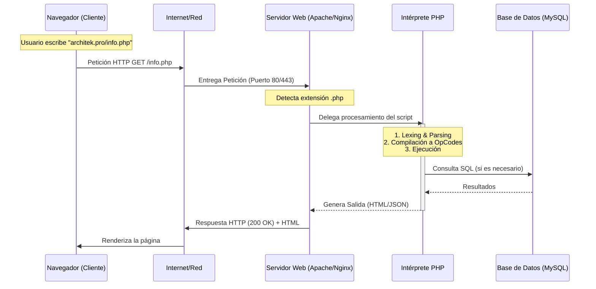

# 3.1 Arquitectura Cliente-Servidor y el Entorno de Ejecución

## Caso de Uso

**Escenario:** Una empresa de logística global necesita un sistema de rastreo de paquetes en tiempo real.
**Problema:** Los clientes acceden desde navegadores web y aplicaciones móviles. La lógica de cálculo de rutas y el estado de los paquetes no pueden residir en el dispositivo del cliente por razones de seguridad y consistencia.
**Solución:** Implementar una arquitectura Cliente-Servidor donde un servidor centralizado procesa las peticiones y devuelve la información actualizada.

---

## El Modelo de Petición-Respuesta (Request-Response)

PHP es un lenguaje de **lado del servidor (Backend)**. Para entender su funcionamiento, debemos comprender el ciclo de vida de una petición HTTP. A diferencia de JavaScript, que se ejecuta en el navegador del cliente, PHP vive y muere en el servidor.

### Diagrama de Secuencia: El Ciclo de Vida

### Componentes del Stack (XAMPP/LAMP)

Para simular este entorno de producción en una máquina local de desarrollo, utilizamos pilas de software como XAMPP.

1.  **Sistema Operativo (Cross-Platform):** La base donde se ejecutan los servicios.
2.  **Servidor Web (Apache/Nginx):** El "recepcionista". Escucha en los puertos HTTP (80) y HTTPS (443). Su trabajo es servir archivos estáticos (imágenes, CSS) y delegar los archivos dinámicos (`.php`) al intérprete.
    *   **Directorio Raíz (`htdocs` / `www`):** Es la única carpeta que el servidor web expone al mundo exterior. Por seguridad, el código fuente sensible y la configuración deben estar fuera de este directorio siempre que sea posible.
3.  **Intérprete (PHP):** El "cerebro". Ejecuta la lógica, manipula datos y se conecta a otros servicios.
4.  **Base de Datos (MariaDB/MySQL):** La "memoria a largo plazo". Almacena los datos de forma persistente.

### Verificación de Ingeniería

Para un ingeniero de sistemas, "funciona" no es suficiente. Debemos verificar la configuración del entorno.

1.  **Estado de Servicios:** En XAMPP Control Panel, Apache y MySQL deben estar en verde (corriendo).
2.  **Puertos:** Verificar que no haya conflictos (ej. Skype usando el puerto 80).
3.  **Info:** El archivo `phpinfo()` no es solo una prueba de "hola mundo"; es un reporte técnico completo de los módulos cargados, límites de memoria (`memory_limit`), tiempos de ejecución (`max_execution_time`) y configuraciones de seguridad.

> **⚠️ Advertencia de Seguridad:** Nunca deje un archivo con `phpinfo()` en un servidor de producción accesible públicamente. Revela información crítica de la arquitectura que un atacante puede utilizar (Information Disclosure).
